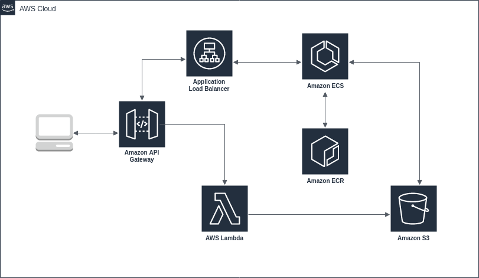

THIS IS JUST A POSSIBILITY ON HOW IT COULD BE MANAGED IT AWS CLOUD

Since the model is trained fast, we will be using a lambda to train it in order to control expenses, the model will be saved in a s3 instance to maintain consistency between the docker instances that will use it.

The training trigger will occur by hitting a public ennndpoint mapped on API Gateway.

Prediction pipeline will start with a request to API Gateway that will make the respective parameter verifications, API Gateway will also help us to achieve different version for our models in the future.

An ELB is responsible to redirect the traffic betweenn the containers that are in ECS (which will get their images in ECR).

ECS will be responsible of scaling those containers based on a target (CPU usage for instance). Those container use flask framework to expose endpoint. 

When a new container is spinned up, it will make a request to get the model on S3, load it, and then it is ready for predictions.
